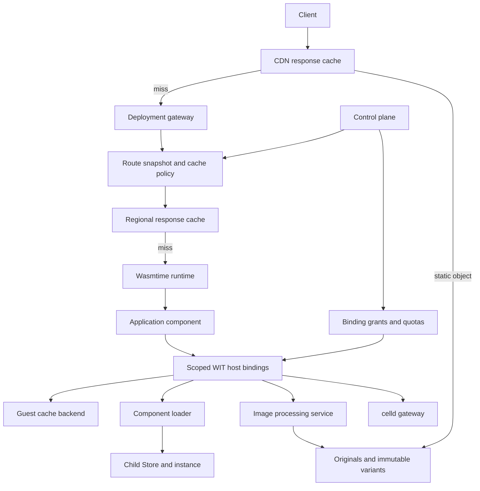

# Edge Platform Capabilities

Design proposal, 2026-09-13. This extends odenctl's deployment platform with
response caching, dynamically loaded components, and image delivery. Application
contracts stay language-neutral and versioned through WIT.

The binary transport prerequisite and [binary HTTP example](../../examples/binary-http/README.md)
are implemented, along with the [Node gateway response cache](../user/response-cache.md)
and its [real component example](../../examples/response-cache/README.md). The WIT
guest cache, loader, image service, and CDN resources below remain proposed work.
The [static-site release example](../../examples/static-site/README.md) now verifies
component-embedded assets, gateway caching, updates, and rollback in Chromium.
AWS is the initial backend candidate, following the
existing ECS/Fargate deployment; the backend choice is not yet settled.

## Product boundaries

Cloudflare exposes several distinct capabilities:

| Capability | Reference behavior | odenctl direction |
| --- | --- | --- |
| Workers Cache / CDN response caching | Cached responses can bypass Worker execution | Cache before component invocation; explicit route policy |
| Workers Cache API | Guest-controlled response lookup, insertion, and deletion; contents are local to the originating data center | A scoped WIT cache binding with documented locality |
| Dynamic Workers | Load code at runtime, return a callable worker, constrain its bindings and network access | Load a Wasm component and return a scoped HTTP handler resource |
| Images transformations | Resize/convert images, with a Worker binding for byte-stream input and output | A WIT image binding backed by a dedicated image processor |
| Images storage and delivery | Managed originals and delivery are separate concerns from transformation | Object storage, upload authorization, immutable variants, and CDN delivery |

Cloudflare's [Cache API](https://developers.cloudflare.com/workers/runtime-apis/cache/)
is independent of [Workers Cache](https://developers.cloudflare.com/workers/cache/).
The Cache API is not a replicated KV store and its `put`/`match` operations do not
support stale-while-revalidate or stale-if-error. Implement these semantics
explicitly in a response-cache layer rather than assuming a guest cache call
provides them.

The [Dynamic Workers loader](https://developers.cloudflare.com/dynamic-workers/api-reference/)
has a one-off `load` operation and an ID-based `get` operation. Reuse of an isolate
is not guaranteed; the same ID must identify the same code/configuration. This
fits an immutable component identity with disposable Wasmtime instances.

The [Images binding](https://developers.cloudflare.com/images/optimization/binding/)
can process source bytes and chain transformations. Its results are not automatically
cached. Original storage, transformation execution, and result caching should be
separate parts of odenctl's implementation too.

The target is equivalent capabilities for Rust, MoonBit, and other component
languages. JavaScript API compatibility, `workerd` execution, and source-level
compatibility with existing Workers applications would be separate projects.

## Existing foundations and gaps

| Foundation | Current implementation | Extension needed |
| --- | --- | --- |
| Deployments and routing | Immutable artifacts, weighted route snapshots, placement; gateway cache clears on accepted snapshot updates | Publish cache policy through the control plane |
| Component loading | Artifact materialization and compilation in `crates/odenctl/src/runtime/supervisor.ts`; prepared cache in `crates/runtime-core/src/node.rs` | Guest-accessible loader with delegated grants |
| Execution | Wasmtime, fresh Store per node request, deadlines, memory and I/O limits | Child execution accounting, depth limits, compilation budgets |
| Persistence | Standalone celld WIT adapter | Deployment binding provisioning and recovery integration |
| Observability | Host/guest telemetry, context propagation; gateway cache statistics and per-request cache status | Image transform work, child calls and compilation accounting |
| Delivery | AWS ALB + ECS/Fargate module | CDN, original/variant object storage, image service |
| Binary HTTP | WASI/direct HTTP and JSON invocation adapters preserve bytes; browser tests verify PNG delivery | Image transformation/storage services |

The node's prepared-component cache caches executable artifacts. The optional Node
gateway response cache stores HTTP responses separately. A component that is loaded lazily through route selection is not
yet a Dynamic Worker API available to another guest.

The old custom service/KV/DO bindings were removed from the worker runtime.
Some control-plane records still describe those resources, but that does not
make them available to guests. Add new WIT host adapters and provision their
grants deliberately; do not reactivate the old custom worker world.

## Placement of the new capabilities

The control plane owns policy, identities, deployment changes, grants, and quotas.
The data plane serves requests from validated snapshots without a control-plane
round trip. WIT host adapters enforce capability scopes and translate between guest
resources and backend services. Credentials and backend endpoints stay in host
configuration.

On AWS, use CloudFront for public edge delivery, S3 for original/variant objects,
and ECS for the runtime and image processor. This provides edge caching in front
of a regional Wasmtime origin; it does not place Wasmtime execution at every CDN
location. A self-hosted deployment can replace the CDN and object-store adapters
while retaining the guest contracts.

## 1. Response cache and guest Cache API

Start with explicit public routes. The implemented gateway cache uses a validated,
operator-owned JSON policy loaded at startup, with project/host/path rules, TTL
bounds, header variants and size limits. Publishing a versioned policy through
deployment snapshots is a later extension. See the [cache guide](../user/response-cache.md)
for its precise supported subset and local purge behavior.

The implementation must distinguish:

- **CDN response cache:** a hit avoids the runtime gateway and component invocation.
- **Regional response cache:** a hit reaches the gateway but avoids component invocation.
- **Guest cache binding:** the component executes and explicitly reads/writes a cache.

For gateway caches, select the authorized tenant, route and weighted deployment
before constructing the key. Use a tuple containing tenant, cache namespace/revision,
deployment identity, scheme/authority, exact path/query, and configured variants.
Do not normalize query ordering unless the application opts into that equivalence.
Guest-provided headers cannot override the tenant or deployment scope.

Begin with GET/HEAD, complete HTTP 200 responses, bounded bodies, and an explicit
positive shared TTL. HEAD can read a GET entry without returning its body and
must not populate a GET entry with an empty body. Bypass on credentials/cookies,
`no-store`, `private`, `Set-Cookie`, unsupported `Vary`, range requests, upgrades,
and incomplete/erroring streams. Subsequent iterations can add validators,
revalidation, ranges and stale responses after their semantics are tested.

Concurrent fills need a per-key coordinator. Publish only complete cacheable
responses. A cancelled leader must release waiters; an uncacheable result must
not be reused as another caller's authenticated response. Purging advances a
namespace generation so a fill started before a purge cannot repopulate it.

Proposed WIT package: `oden:cache@0.1.0`. A binding opens an opaque cache
resource supporting `match`, `put`, and `delete`. Use WASI HTTP types or bounded
stream-based messages, not arbitrary serialized JS objects. Bindings scope every
operation to a host-selected namespace. Entry presence is best-effort and eviction
is permitted; cache success is never a durable-storage acknowledgement.

**CDN invalidation is a separate operation.** Guest `delete` initially affects its
documented local/regional backend. A tenant-authorized control-plane purge creates
an asynchronous job with status and retries for all relevant CDN/cache adapters.
Neither a local deletion nor a submitted provider invalidation proves global
completion.

CloudFront's cache key cannot infer a deployment version from origin response
headers. For the first AWS implementation, cache versioned public assets and image
variant URLs; leave generic application/API routes uncached. A later route cache
must either put a trusted release revision into the key before lookup or manage
invalidation on activation/rollback with explicitly bounded stale behavior.
Canary routing must be resolved before cache selection or bypass shared CDN caching.

Set minimum TTL to zero in response-header-driven CloudFront policies: a positive
minimum TTL can override `private`/`no-store` origin directives, as described in
[AWS's cache-policy documentation](https://docs.aws.amazon.com/AmazonCloudFront/latest/DeveloperGuide/cache-key-understand-cache-policy.html).
Do not assume a request-level bypass rule implemented in the gateway also bypasses
a CDN hit. Authenticated routes need a compatible edge policy or caching disabled
for the entire route. Forwarding a header to the origin and including it in the
cache key are different configuration decisions.

Acceptance criteria: tenant and deployment separation, TTL expiry with a fake
clock, GET/HEAD correctness, Vary separation, bypass cases, one cacheable fill under
concurrency, purge racing a fill, rollback/canary behavior, and binary body integrity.

## 2. Dynamic components

Proposed WIT package: `oden:workers@0.1.0`. Provide a loader binding with
`load`/`get` operations returning an opaque worker resource with async HTTP `fetch`.
Begin with registered immutable `.wasm` artifact digests. A later bounded upload
operation can accept new component bytes for temporary executions and previews.

Do not accept untrusted `.cwasm` machine-code caches as uploaded artifacts. Compile
Wasm through the validated toolchain; only reuse native caches produced by a
trusted compiler for the matching engine build, target, and configuration.

Separate identities and caches:

1. Artifact: component bytes and digest.
2. Compiled code: digest + engine/build/target/configuration + import contract.
3. Callable handle: tenant + artifact + effective binding configuration and limits.
4. Execution: a fresh child Store, resource table and HTTP invocation.

`get` may reuse preparation, but promises no in-memory state retention. Durable
state belongs behind a persistence binding. `load` creates a new callable handle;
reusing compiled code internally is permitted.

The parent can only delegate a subset of its authorized capabilities. No automatic
inheritance of environment variables, secrets, filesystem access, network origins,
or durable bindings. The host validates effective grants and enforces both
per-child limits and cumulative parent/tenant budgets, including compilation,
in-flight children, bytes, calls, and recursion depth.

The child's deadline is bounded by the parent's remaining deadline. Parent
cancellation drops children and their streams. Acquire resources without holding
parent Store access across a child invocation; nested calls must not deadlock a
single-threaded event loop or exhaust the only admission slot indefinitely.

Guest resource handles cannot be moved between Stores. The host bridges request
and response streams into each Store's resource table and propagates explicit
trace context. `wac compose` remains the static composition mechanism; loading an
independent component at runtime is a separate lifecycle and authorization path.

Acceptance criteria: Rust parent/MoonBit child and the reverse, inherited-denial
tests, stable digest caching, configuration changes not reusing stale grants,
parent/child deadlines, cancellation cleanup, recursive-call limits, and traps
that leave unrelated requests working.

## 3. Images

Deliver a useful vertical slice first: immutable original objects, named transform
presets, JPEG/PNG input, JPEG/PNG/WebP output, and public variant URLs. Add AVIF,
animated formats, SVG, overlays, metadata policies and private delivery separately.

Use a dedicated processor with independent memory/CPU/concurrency limits. An
[imgproxy](https://docs.imgproxy.net/latest/) backend is a candidate because it uses
libvips and supports signed processing URLs. odenctl's application contract must
not expose that backend's unrestricted URL syntax.

The control plane owns image IDs, original versions, allowed presets, upload
authorization, deletion, and access policy. The processor obtains source bytes
through a scoped object-store reference. For remote sources, the host enforces
the same source policy on redirects and resolved destinations; an arbitrary URL
is not an image-store capability.

Proposed WIT package: `oden:images@0.1.0`, with `info` and async `transform`.
Use an opaque object/source reference or a bounded byte stream plus validated
transform options. Return a stream and metadata or an immutable variant reference.
Applications should not carry AWS credentials or processor signing keys.

Key a derivative by tenant, original content digest, canonical transform options,
output format, and processor version. Changing an original or processor produces
a new URL. Use the same key for duplicate-transform suppression and stored output.
If output format depends on `Accept`, resolve it into an explicit variant URL or
include the normalized format decision in every cache layer's key.

Enforce source-byte, decoded-pixel, frame-count, dimension, output-byte and transform
time limits. Presets bound the number of variants. A timeout does not publish a
partial object. Deleting an original must also remove/expire derived objects and
initiate CDN invalidation; define the observable completion state. For private
images, authorization must run before a cache hit through signed delivery or an
uncached authorization route.

Acceptance criteria: fixture pixels/dimensions, format and orientation behavior,
binary round trips, deterministic keys, duplicate-transform suppression, tenant
isolation, preset denial, oversized decoded images, partial failures, source
replacement, and deletion/invalidation.

## Implementation order

| Phase | Deliverable | Status |
| --- | --- | --- |
| 0 | Binary invocation envelope and a real P3 echo integration test | Implemented |
| 1 | Public immutable assets, CDN adapter, object storage and purge jobs | Planned; choose deployment backend |
| 2a | Per-gateway response cache, public route policy, bounded fills and local purge | Implemented ahead of CDN integration; policy is a startup file |
| 2b | WIT guest cache and control-plane policy publication | Planned |
| 3 | Dynamic loader WIT, child lifetime and delegated capability enforcement | Planned |
| 4 | Images storage/transform/delivery pipeline on top of the cache/object foundations | Planned |

Define each contract and observable behavior before implementation, use Red/Green
tests for the boundary, then supply the backend. `oden test` can exercise guest
assertions; HTTP, multi-process, and provider tests must cover delivery and lifetime.
Local mocks and kumo are useful for contract checks but do not prove real CDN
invalidation, AWS IAM behavior, multi-region placement, or image processing limits.

Track cache hit/miss/bypass and age, bytes served without execution, avoided guest
invocations, child compile/instantiate/call latency, compilation queue time,
transform queue/duration, and original/variant storage. Attribute work to tenant
and deployment internally without placing unbounded URLs or object IDs in metric
labels. Keep cache hits visible even when no guest span exists.
