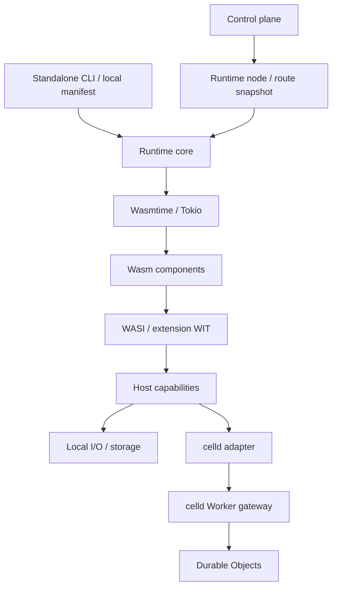

# Standalone Wasm Runtime Direction

Decision date: 2026-09-11. Make a standalone Wasm application runtime the core, and use the same
execution engine from odenctl's control plane. The runtime core, standalone CLI, versioned Durable Object
WIT interface, and local celld gateway validation are implemented.
See the [runtime guide](standalone-runtime.md) for usage and implementation limits.
Fleet failure recovery and direct Wasmtime actor integration remain under evaluation.

## Direction

- Extract Rust's Wasmtime embedding into an independent runtime core.
- Allow local applications to start without a control plane, project registry, or billing database.
- Use the latest upstream stable Wasmtime at implementation time, or `mizchi/wasmtime-threads`.
- Define application–host contracts with WIT and types so I/O and persistence implementations can be replaced.
- Evaluate `denoland/celld` Durable Objects as a backend.
- Accept Wasm components first. Add JS/TS support and a Node.js compatibility layer in separate stages.

## Separate execution from placement

The runtime core owns the Engine, component loading/linking, Store lifetime, execution limits, and task
cancellation. The CLI and runtime node pass configuration and requests through the same contract.
Project/deployment IDs are placement metadata, not required inputs for standalone execution.
The old custom WIT was removed, and deployment and route snapshot worlds were updated to `wasi:http/service@0.3.0`.

The standalone `oden` CLI implements commands, ordinary HTTP, resident services,
application manifests, file watching, preflight inspection, and exported tests.
Rust and MoonBit SDKs share the [service runtime](service-runtime.md) contract.
WAC can compose components before execution, including the tested telemetry
wrappers; oden runs the resulting component. Runtime-managed dependency graphs
and guest-accessible dynamic component loading remain future work.

## Reuse from the existing implementation

| Existing implementation | Reuse or change |
| --- | --- |
| `Wasip3Runtime` in `crates/runtime-core/src/node.rs` | Node adapter for standard WASI HTTP; reuse the prepared cache, pooling, and execution limits |
| `compile` / `invoke` / `serve` in `crates/odenctl/src/main.rs` | Separate standalone CLI and node invocation boundaries |
| `crates/oden/src/standalone.rs` | `oden` application commands; the deployment host lives in `crates/odenctl` |
| `wit/standard-http` | Validation contracts for standard WASI 0.3 HTTP and Rust std's WASI 0.2 imports |
| `examples/rust-moonbit-release` | Verify compatibility of Rust and MoonBit component composition |
| `crates/odenctl/src/runtime/wasip3-host.ts` | Runtime integration on the control plane side |

Standalone and node execution share standard WASI HTTP with asynchronous I/O, bounded streams,
cancellation, and deadlines that extend through body completion. The node JSON protocol buffers bodies within a size limit.
The old WIT body / KV / Secrets / storage / service imports and instance reuse/reset contract were removed.

Regular HTTP and the node adapter create a Store per request. Resident services keep one Store per generation.
Caching prepared components is separate from durable actor identity and state recovery after a crash;
the latter responsibilities belong to the celld contract.

## Wasmtime selection and updates

The latest upstream stable release verified through the GitHub Releases API on 2026-09-11 was
[48.0.2](https://github.com/bytecodealliance/wasmtime/releases/tag/v48.0.2), published on 2026-09-10 UTC.
All related Cargo dependencies are pinned to `=48.0.2`. Existing workers and Rust/MoonBit composition
were verified with wasm-tools 1.259.0 / wit-bindgen 0.62.0.
`--async all` was removed because it generates async ABIs even for synchronous WIT functions;
bindings now follow the WIT declarations.

The fork revision evaluated was
[`mizchi/wasmtime-threads` at `e1fb408fb7258ac8d1207084af4e1988b3c7db87`](https://github.com/mizchi/wasmtime-threads/tree/e1fb408fb7258ac8d1207084af4e1988b3c7db87).
Its workspace version is `49.0.0-dev`, and it requires Rust `1.96.0`.
If adopted, pin a commit rather than following a moving branch.

Choose upstream or the fork at build time. Align `wasmtime`, `wasmtime-wasi`, `wasmtime-wasi-http`,
and related crates to the same release or fork revision, and record their provenance in the lockfile and build information.
Do not mix `Store` / `Linker` types from different sources. Verify the corresponding WASI WIT,
bindings generator, and composition tools together.
Separate `.cwasm` artifacts by engine source/revision, configuration, target, and host build.

Use a bounded worker pool with independent Stores / Instances per worker as the baseline for parallel execution.
Verify Component Model async, parallel execution across Stores, and guest threads using shared memory as separate features.

The fork's OS-thread path requires `experimental-component-threads` and runtime opt-in.
It rejects components with Component Model resources or GC canonical options.
Standard WASI HTTP and Durable Object extensions use resources, so compatibility with this experimental path
must not be assumed. Establish the independent-Store path first, then compare shared-memory experiments with limited fixtures.
See the [fork's supported scope](https://github.com/mizchi/wasmtime-threads/blob/e1fb408fb7258ac8d1207084af4e1988b3c7db87/docs/experimental-fork-goal.md)
and [build and execution requirements](https://github.com/mizchi/wasmtime-threads/blob/e1fb408fb7258ac8d1207084af4e1988b3c7db87/docs/experimental-vibe-thread-contract.md).

## celld Durable Objects integration

The evaluated version is celld `v0.4.1`, commit
[`10cb1303dac710dcb3b557e318e08c855261f68b`](https://github.com/denoland/celld/tree/10cb1303dac710dcb3b557e318e08c855261f68b).
The HTTP adapter below is implemented and verified against a real celld dev process.
This does not mean celld itself accepts Wasmtime components.

### Initial validation: HTTP to a separate process

The Wasm guest specifies a binding and object name. A host adapter forwards the call over HTTP to a Worker gateway
running on celld, which dispatches to the target Durable Object through `idFromName` / `get` / `fetch`.
This can be validated by extending celld's
[counter example](https://github.com/denoland/celld/blob/10cb1303dac710dcb3b557e318e08c855261f68b/examples/counter/index.js).

celld owns object ownership, SQLite, persistence, and recovery. oden owns guest execution,
binding authorization, and request forwarding. The initial DO logic runs as JavaScript in celld.
Making the Wasmtime guest itself a celld durable actor is a later integration stage.

Place the gateway on celld's public Worker listener and authenticate the adapter at the gateway.
The celld adapter has a WIT contract separate from the standard HTTP world.
Keep credentials, endpoints, and application-to-namespace mappings in host configuration.
Do not expose arbitrary destination URLs, fleet credentials, or internal cell IDs to guests.
celld's internal `/do/<ID>` is an unauthenticated operator API that may change between releases;
it is not a guest API endpoint.
See [celld listeners and authentication boundaries](https://github.com/denoland/celld/blob/10cb1303dac710dcb3b557e318e08c855261f68b/docs/security.md).

### Contract decisions

Define actor calls as a versioned interface.
The added `oden:durable/objects@0.1.0` contract is:

| Area | Proposed contract |
| --- | --- |
| Identity | Host configuration maps a binding to a gateway endpoint and namespace, with an object name inside that scope. Operators assign separate scopes to applications. |
| Handle | An opaque resource per execution. Persist identity as a tuple of strings, never as a numeric handle. |
| Operation | Start with HTTP-style `fetch`. Evaluate typed RPC, SQL, alarms, and WebSockets as additional contracts. |
| Errors | Binding denial, connection failure, timeout, and unknown outcome are transport errors, separate from the HTTP status returned by the DO. |
| Limits | Enforce deadlines, body size, concurrent calls, and cancellation in the host. |
| Retry | Do not automatically retry requests with side effects. Retries require a request ID and durable deduplication in the DO. |

Timeout or cancellation does not imply a rollback in the DO. Represent an applied update whose response was lost
as `outcome-unknown`. celld's durability specifies the conditions for persisting state acknowledged by a successful
response; it does not guarantee exactly-once execution of external HTTP requests.

Separate guest-side HTTP requests for `get → compute → put` do not make the whole operation atomic.
Keep operations such as counter increments inside the DO. When porting an existing storage API,
distinguish replacing it with remote KV from actor serialization and transactions.

### Persistence and placement validation

celld uses ownership epochs and durability proofs. Evaluate prerequisites such as conditional bucket writes
and the gate for successful responses. The host adapter must not acknowledge success early just because SQLite
accepted a write. Also verify updates with unknown outcomes that become visible after recovery.
See [celld guarantees and assumptions](https://github.com/denoland/celld/blob/10cb1303dac710dcb3b557e318e08c855261f68b/docs/guarantees.md).

At the evaluated revision, celld assumes one application per fleet and does not support mutually untrusted tenants
sharing a fleet. Start within one trust boundary. Supporting multiple projects requires an explicit mapping from
odenctl projects to fleets; do not assume isolation equivalent to the existing multi-tenant system.
See [celld limitations](https://github.com/denoland/celld/blob/10cb1303dac710dcb3b557e318e08c855261f68b/docs/limitations.md).

### Future evaluation: add Wasmtime as a celld execution host

celld's `crates/logic` is an I/O-free decision layer, while `crates/celld/runtime.rs` is coupled to V8 execution.
Reusing the logic or building a Wasmtime effect executor are research options; a complete interchangeable
runtime plugin API should not be assumed to exist.
See the [logic crate](https://github.com/denoland/celld/blob/10cb1303dac710dcb3b557e318e08c855261f68b/crates/logic/Cargo.toml)
and [runtime implementation](https://github.com/denoland/celld/blob/10cb1303dac710dcb3b557e318e08c855261f68b/crates/celld/runtime.rs).

celld's existing Wasm support loads core Wasm modules from JavaScript; it is not a WASI Component Model host.
Direct integration must connect the WIT actor lifecycle, storage transactions, output gates, alarm replay,
and Store termination on ownership loss.
See [celld Wasm support](https://github.com/denoland/celld/blob/10cb1303dac710dcb3b557e318e08c855261f68b/docs/wasm.md).

## Implementation order and acceptance criteria

Use exploration → Red → Green → Refactoring at each stage. Do not set performance targets before measuring.

1. **Engine update and standard WASI contracts**: verify standard HTTP components and Rust/MoonBit composition
   against the latest upstream version. First add tests that prevent mixing `.cwasm` artifacts from different engine builds.
   If the fork is needed, run the same contract tests against a separate build pinned to a revision.
2. **Standalone runtime**: first write black-box tests that start command / HTTP components without a database or
   control plane. Verify exit codes, permission denial, and resource release during shutdown.
3. **Asynchronous I/O and task lifetime**: use a test server that waits for multiple requests before responding
   to verify that I/O progresses concurrently. Cover bounded bodies, cancellation, traps, and child task cleanup.
4. **celld gateway prototype**: call a named counter through local `celld dev`. Verify namespace isolation,
   concurrent increments, state after restart, lost responses, and deduplication on retry. Keep host adapter unit tests
   separate from real celld integration tests; a successful connection alone is insufficient.
5. **celld fleet and direct integration evaluation**: test fleet ownership transfer and failure recovery in a separate stage.
   Use local validation results to decide whether to retain the JS gateway or add a Wasmtime actor host.

Use `justfile` as the task entry point and pnpm / Node.js 24+ for JavaScript.
Use appropriate integration tests for HTTP and processes, and Playwright for browser UI.
