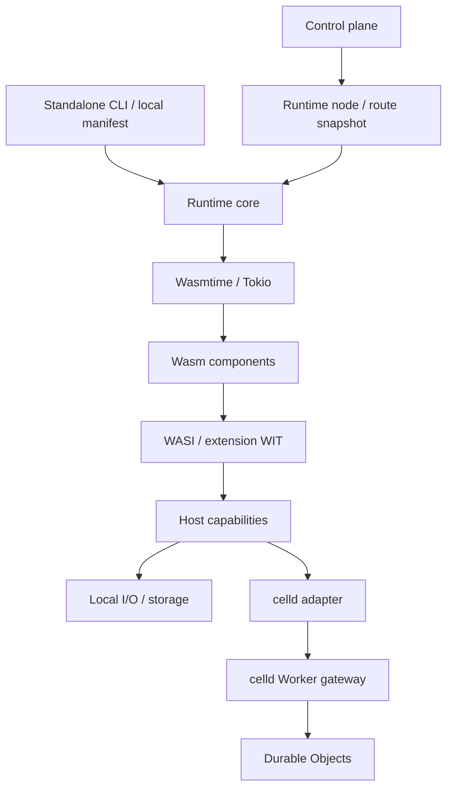

# Standalone Wasm runtime direction

決定日: 2026-09-11。単体で動く Wasm アプリランタイムを核にし、wasmplane の
control plane からも同じ実行基盤を利用する。
runtime core、単体 CLI、versioned Durable Object WIT、celld gateway のローカル検証まで実装した。
利用方法と実装上の制約は [runtime guide](standalone-runtime.md) を参照。
fleet の障害復旧と Wasmtime actor の直接統合は引き続き評価対象である。

## 採用する方向性

- Rust の Wasmtime embedding を独立した runtime core にする。
- control plane、project registry、billing DB なしでローカルアプリを起動できるようにする。
- Wasmtime は実装時点の upstream 最新安定版、または `mizchi/wasmtime-threads` を使う。
- WIT と型でアプリ・ホストの契約を定め、I/O や永続化の実装を交換できるようにする。
- `denoland/celld` の Durable Objects を接続先として評価する。
- 最初は Wasm component を入力にする。JS/TS と Node.js 互換層は別の追加段階とする。

## 実行基盤と配置の分離

runtime core は Engine、component load/link、Store の寿命、実行制限、タスクの
キャンセルを担当する。CLI と runtime node は同じ契約へ、設定と要求を渡す。
project/deployment ID は配置側のメタデータとし、単体実行の必須入力にしない。
旧独自 WIT は削除し、deployment と route snapshot の world を `wasi:http/service@0.3.0` に更新した。

CLI の最初の対象は command component の `run` と HTTP component の `serve`。
`wasmplane run` / `wasmplane serve` として実装済み。
常駐 lifecycle、単一 component の manifest と `build/start/dev`、Rust/MoonBit SDK は
[service runtime](service-runtime.md) として追加した。複数 component のアプリ構成管理は今後の対象。

## 現実装から流用するもの

| 現実装 | 流用・変更方針 |
| --- | --- |
| `crates/runtime-core/src/node.rs` の `Wasip3Runtime` | 標準 WASI HTTP 用 node adapter。prepared cache、pooling、実行制限を利用 |
| `crates/wasip3-host/src/main.rs` の `compile` / `invoke` / `serve` | 単体 CLI と node 用の呼び出し境界を分ける |
| `wit/standard-http` | 標準 WASI 0.3 HTTP と Rust std の WASI 0.2 import の検証用契約 |
| `examples/rust-moonbit-release` | Rust と MoonBit の component composition の互換性検証に使う |
| `src/runtime/wasip3-host.ts` | control plane 側の runtime 接続として扱う |

標準 WASI HTTP を standalone と node で共有し、非同期 I/O、bounded stream、
キャンセル、body 完了までの deadline を適用する。node JSON protocol は body を上限内で蓄積する。
旧 WIT の body / KV / Secrets / storage / service imports と instance reuse/reset 契約は削除した。

通常の HTTP と node adapter はリクエストごとに Store を作る。常駐 service は世代ごとに1つの Store を保持する。
component の準備を cache することと、永続 actor の identity や
クラッシュ後の状態復元は別の責務とし、後者は celld の契約で扱う。

## Wasmtime の選定と更新

2026-09-11 に GitHub Releases API で確認した upstream 最新安定版は
[48.0.2](https://github.com/bytecodealliance/wasmtime/releases/tag/v48.0.2)
（2026-09-10 UTC 公開）。関連 Cargo dependencies をすべて `=48.0.2` に固定し、
wasm-tools 1.259.0 / wit-bindgen 0.62.0 で既存 worker と Rust/MoonBit composition を検証した。
`--async all` は同期 WIT 関数にも async ABI を生成するため廃止し、WIT の宣言に従って生成する。

fork の調査対象は
[`mizchi/wasmtime-threads` の `e1fb408fb7258ac8d1207084af4e1988b3c7db87`](https://github.com/mizchi/wasmtime-threads/tree/e1fb408fb7258ac8d1207084af4e1988b3c7db87)。
その workspace version は `49.0.0-dev`、必要な Rust は `1.96.0`。
採用時は branch の移動に追従する依存ではなく commit を固定する。

upstream/fork の選択はビルド時に行う。`wasmtime`、`wasmtime-wasi`、
`wasmtime-wasi-http` など関連 crate を同じ release または同じ fork revision に揃え、
lockfile とビルド情報に出自を記録する。異なる source の `Store` / `Linker` を混在させない。
対応する WASI WIT、bindings generator、composition tool も一緒に検証する。
`.cwasm` は engine source/revision、設定、target、host build ごとに分離する。

通常の並列実行は、bounded worker pool と worker ごとの独立した Store / Instance を
基準にする。Component Model の async、複数 Store の並列実行、guest の共有メモリを使う
スレッド実行は、別々の機能として検証する。

fork の OS-thread 経路は `experimental-component-threads` と runtime opt-in が必要な
実験機能で、Component Model resource や GC canonical option を持つ component を拒否する。
標準 WASI HTTP と Durable Object 拡張は resource を使うため、
そのままこの実験経路へ移せるとは扱わない。まず独立 Store の経路を成立させ、
共有メモリの実験は限定した fixture で比較する。
[fork の対応範囲](https://github.com/mizchi/wasmtime-threads/blob/e1fb408fb7258ac8d1207084af4e1988b3c7db87/docs/experimental-fork-goal.md)、
[ビルドと実行の条件](https://github.com/mizchi/wasmtime-threads/blob/e1fb408fb7258ac8d1207084af4e1988b3c7db87/docs/experimental-vibe-thread-contract.md)。

## celld Durable Objects の接続案

調査対象は celld `v0.4.1` / commit
[`10cb1303dac710dcb3b557e318e08c855261f68b`](https://github.com/denoland/celld/tree/10cb1303dac710dcb3b557e318e08c855261f68b)。
以下の HTTP adapter を実装し、celld dev の実プロセスで検証した。
celld 自体が Wasmtime component を受け付けるという意味ではない。

### 最初の検証: 別プロセスへの HTTP 接続

Wasm guest から binding と object name を指定して呼び出し、host adapter が celld 上の
Worker gateway へ HTTP で転送する。gateway は `idFromName` / `get` / `fetch` で
目的の Durable Object に dispatch する。この形は celld の
[counter example](https://github.com/denoland/celld/blob/10cb1303dac710dcb3b557e318e08c855261f68b/examples/counter/index.js)
を拡張して検証できる。

celld は object の所有権、SQLite、永続化、復旧を担当し、wasmplane は guest 実行、
binding の認可、要求の転送を担当する。最初の DO のロジックは celld 側の JS で動く。
Wasmtime guest 自体が celld の durable actor になることは、次の統合段階とする。

celld の公開 Worker listener に gateway を配置し、gateway 側でも adapter を認証する。
celld adapter は標準 HTTP world とは独立した WIT 契約を持つ。
認証情報、接続先、アプリ・namespace の対応はホスト設定に閉じ込める。
guest に任意の接続 URL、fleet credentials、内部の cell ID は渡さない。
celld の内部 `/do/<ID>` は認証なしの operator API で、release ごとに変わりうるため、
guest API の接続先にしない。
[celld の listener と認証境界](https://github.com/denoland/celld/blob/10cb1303dac710dcb3b557e318e08c855261f68b/docs/security.md)。

### 契約で先に決めること

actor 呼び出しは versioned interface として定義する。
`wasmplane:durable/objects@0.1.0` として追加した契約は次の通り。

| 項目 | 提案する契約 |
| --- | --- |
| identity | ホスト設定で binding を gateway endpoint と namespace に写像し、その中の object name を使う。アプリごとに別 scope を割り当てるのは運用側の責務 |
| handle | 実行ごとの opaque resource。永続 identity は文字列の組で保持し、数値 handle を保存しない |
| operation | まず HTTP 形式の `fetch`。型付き RPC、SQL、alarm、WebSocket は追加契約として評価する |
| errors | binding 拒否、接続失敗、timeout、結果不明を transport error とし、DO が返す HTTP status と分ける |
| limits | deadline、body size、同時呼び出し数、キャンセルをホストで適用する |
| retry | 副作用のある要求を自動再送しない。再送する場合は request ID と DO 内の永続 deduplication をセットで定義する |

timeout / キャンセルは DO 側の rollback を意味しない。更新済みで返答だけ失われた場合を
`outcome-unknown` として扱えるようにする。celld の durability は成功応答した状態の保存を
保証する条件であり、外部 HTTP 要求の exactly-once 実行を保証するものとは扱わない。

guest 側で `get -> 計算 -> put` を別 HTTP 要求として行っても、その全体は atomic にならない。
counter の increment のような操作は DO 内で完結させる。既存 storage API を移植する場合も、
単に remote KV に差し替えた状態と actor の直列化・transaction を区別する。

### 永続化と配置の検証条件

celld は ownership epoch と durability proof を使う。bucket の条件付き書き込みなどの
前提と、成功応答を返す gate を含めて評価し、SQLite に書けた時点で host adapter が
成功を先返ししない。結果不明の更新が復旧後に現れる場合も検証する。
[celld の保証と前提](https://github.com/denoland/celld/blob/10cb1303dac710dcb3b557e318e08c855261f68b/docs/guarantees.md)。

celld は現時点で fleet ごとに１アプリを想定し、相互に信頼しない tenant の混在を
サポートしない。初期評価は１つの信頼境界で行う。複数 project に展開する場合は
wasmplane の project と fleet の対応を設計し、既存の multi-tenant 分離と同等だとは扱わない。
[celld の制約](https://github.com/denoland/celld/blob/10cb1303dac710dcb3b557e318e08c855261f68b/docs/limitations.md)。

### 将来の検証: celld の実行ホストに Wasmtime を追加

celld の `crates/logic` は I/O を持たない判断層で、`crates/celld/runtime.rs` は V8 の
実行層に結び付いている。logic の再利用や Wasmtime 用 effect executor は研究候補だが、
完成した交換可能な runtime plugin API があるとは扱わない。
[logic crate](https://github.com/denoland/celld/blob/10cb1303dac710dcb3b557e318e08c855261f68b/crates/logic/Cargo.toml)、
[runtime 実装](https://github.com/denoland/celld/blob/10cb1303dac710dcb3b557e318e08c855261f68b/crates/celld/runtime.rs)。

celld の既存 Wasm 対応は JS からの core Wasm module 読み込みであり、WASI Component Model
host の実装ではない。直接統合を行うには、WIT actor lifecycle、storage transaction、
output gate、alarm の再実行、ownership 喪失時の Store 停止まで接続する必要がある。
[celld の Wasm 対応](https://github.com/denoland/celld/blob/10cb1303dac710dcb3b557e318e08c855261f68b/docs/wasm.md)。

## 実装順序と受け入れ条件

各段階は探索 → Red → Green → Refactoring で進める。計測前の性能目標値は置かない。

1. **Engine 更新と標準 WASI 契約**: upstream 最新版で標準 HTTP component と Rust/MoonBit composition
   を検証する。異なる engine build の `.cwasm` を混用しないテストを先に置く。
   fork が必要になった場合は固定 revision の別ビルドで同じ契約テストを通す。
2. **Standalone runtime**: DB/control plane が存在しない環境で command / HTTP component を
   起動する black-box test を先に書く。終了コード、権限拒否、停止時の解放まで検証する。
3. **非同期 I/O とタスク寿命**: 複数要求を受け取るまで応答しないテストサーバーを使い、
   I/O が同時に進むことを検証する。bounded body、キャンセル、trap、子タスク回収も対象にする。
4. **celld gateway の試作**: ローカルの `celld dev` で名前付き counter を呼ぶ。
   namespace 分離、並行 increment、再起動後の状態、応答喪失と再送時の重複処理を検証する。
   host adapter 単体テストと実 celld との統合テストを分け、接続成功だけを完了条件にしない。
5. **celld fleet と直接統合の評価**: fleet の所有権移動・障害復旧テストを別段階で行う。
   ローカル検証の結果から JS gateway 継続か Wasmtime actor host 追加かを判断する。

タスクの入口は `justfile`、JS 側は pnpm / Node.js 24+ を使う。HTTP / process の検証は
適切な統合テストを使い、ブラウザー UI を扱う場合は Playwright を使う。
