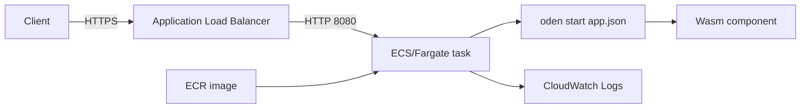

# Standalone oden on AWS

Deploy one Wasm application with its standalone Rust runtime on ECS/Fargate.
The shared [module](../modules/standalone-ecs) provisions ECR, a VPC with two public
subnets, an internet gateway, an HTTPS ALB, an ECS cluster/service, IAM roles, and
CloudWatch Logs. This is separate from the older [control-plane scaffold](../aws).

The [kumo test root](../aws-standalone-kumo) uses the same module with fake credentials
and loopback endpoints. kumo is an AWS API emulator for local validation; it does not
run the Fargate containers or serve application traffic through its virtual ALB.



## Defaults and execution contract

| Setting | Default |
| --- | --- |
| Region / architecture | `ap-northeast-1` / `ARM64` |
| Availability zones | Region suffixes `a` and `c`; override for other regions |
| Fargate resources | 0.5 vCPU, 1024 MiB |
| Task replicas | `0` during ECR bootstrap; set `1` to start the app |
| Container process | `/usr/local/bin/oden start /app/app.json` |
| User / filesystem | UID/GID `65532:65532`, read-only root filesystem |
| Listener | HTTPS 443; HTTP 80 redirects to HTTPS |
| Guest listener | `0.0.0.0:8080` |
| Guest limits | 5-second request deadline, 128 MiB per linear memory, 1 MiB bodies, 64 admitted requests |
| Shutdown | 10-second application deadline, 30-second container stop timeout, 30-second ALB deregistration delay |
| Logs | `/ecs/<name>`, 14-day retention |

The application manifest is baked into the image. ECS environment variables do not
implicitly become guest permissions, and manifest strings do not interpolate secrets.
The task execution role can pull ECR images and write logs; the application task role
has no AWS API permissions. There are no static AWS keys in task definitions.

Tasks receive public IPs for image pulls and outbound access, with inbound port 8080
restricted to the ALB security group. This avoids a NAT gateway in the initial deployment.
The ALB connects to task private IPs. For a private-subnet deployment, supply NAT or
VPC endpoints and adapt the module's networking. See [Fargate networking](https://docs.aws.amazon.com/AmazonECS/latest/developerguide/fargate-task-networking.html).

Replicas have independent resident state. Restarting or replacing a task resets any
in-memory state, and rolling updates can temporarily run old and new tasks together.
No shared filesystem, database, control plane, or celld fleet is provisioned here.
Use an external persistence service for durable state. The deployment sample is
stateless and exposes a side-effect-free `/healthz` route, which is the default ALB
health check. `/` returns service metadata. Diagnostic `/trap`, `/loop` and `/slow`
routes belong to the SDK test fixture and are not included in this image.

## Validate locally with kumo

Requires Node.js 24+, just, OpenTofu, and `tar`. Docker is not needed for API validation.
The installer pins [kumo v0.29.0](https://github.com/sivchari/kumo/releases/tag/v0.29.0)
and verifies the archive against recorded SHA-256 values. macOS/Linux on arm64/amd64 are supported.

```sh
just aws-standalone-validate
just aws-kumo-test
```

`aws-kumo-test` starts its own in-memory kumo process on an ephemeral loopback port,
copies Terraform into a temporary directory, uses dummy credentials, and removes
its process and temporary state on exit. Logs and coverage records go to
`reports/aws-kumo/`, which is ignored by Git. `TF_BIN=terraform` can select Terraform;
Verified with OpenTofu 1.12.1 and AWS provider 5.100.0. `KUMO_BIN=/absolute/path/to/kumo` can select another binary
with the same API behavior; review the smoke scope before adopting another release.

Validation scope is explicit:

| Check | Coverage |
| --- | --- |
| Format, validate, full plan | All resources, including the ECS task definition and service |
| Contract tests | Direct runtime entry point, manifest, read-only filesystem, HTTPS redirect, shutdown allowance |
| kumo apply/read | Network, ALB/listeners/target group, ECR, log group, ECS cluster, IAM roles |
| kumo destroy | Partial: route deletion APIs are missing; remaining test data is discarded by stopping the owned in-memory emulator |
| Full ECS apply | **Unsupported by kumo v0.29.0** |
| Running containers, TLS handshakes, IAM enforcement | Requires Docker or an actual AWS deployment |

The release lacks `DescribeTaskDefinition` and `DescribeServices` in its
[ECS dispatcher](https://github.com/sivchari/kumo/blob/v0.29.0/internal/service/ecs/handlers.go).
The AWS provider cannot complete task/service creation without those read APIs.
The smoke test uses `-target` only to isolate the supported emulator subset; production
plans and applies never use targeting. Execution-role policy creation is also outside this subset.
The release also lacks `DisassociateRouteTable` and `DeleteRouteTable` in its
[EC2 dispatcher](https://github.com/sivchari/kumo/blob/v0.29.0/internal/service/ec2/handlers.go),
so Terraform cannot destroy the complete network graph. The report distinguishes
API deletion from discarding remaining state when the owned emulator exits.

The emulator does not round-trip some tags, listener TLS/redirect settings, and the
health-check matcher, or security-group peer ingress rules. Refresh differences are recorded in `known-emulator-drift.json`;
new differences outside the explicit known set fail the test. No `ignore_changes`
exceptions are added to the production module. A successful local smoke is not a
claim of a drift-free full AWS deployment.

Local verification on 2026-09-12 produced a full plan for 21 AWS resources.
The emulator subset created 18 resources, reported 9 known read differences, and
deleted 11 resources through AWS APIs. The remaining 7 network resources were
explicitly recorded and discarded by terminating the owned in-memory kumo process.
The native runtime passed the packaged-manifest HTTP/SIGTERM test. Docker image
building and actual AWS deployment were not performed in that verification run.

On 2026-09-13, the stateless deployment sample passed both the native manifest
test and the actual Linux ARM64 container test. The container completed two
start/SIGTERM cycles at 0.5 CPU and 1 GiB with a read-only root filesystem and
non-root user. Kumo validation passed again with the `/healthz` default. These
checks do not include an actual AWS deployment. See the
[first-service operating procedure](../../../docs/user/operations.md) for release,
observability and recovery steps.

## Build and test the application image

The [standalone Dockerfile](../../../Dockerfile.standalone) builds the Rust host and
bundled [deployment sample](../../aws-image/service/src/lib.rs) in release mode,
then packages them in a Debian image without Node.js.

```sh
just aws-image-test
just aws-image-build
just aws-container-test
```

`aws-image-test` uses the host binary to verify the packaged manifest, guest imports/exports,
HTTP responses, health checks, absent diagnostic routes, and graceful SIGTERM
shutdown. It does not start Docker. `aws-container-test` starts the actual image
with a read-only root filesystem, no added Linux capabilities, 0.5 CPU and 1 GiB
of memory. It checks HTTP behavior and graceful shutdown across two starts, then
removes its own container.
`aws-image-build` requires a running Docker daemon with Buildx and defaults to `linux/arm64`.
For x86 Fargate, use `just aws-image-build oden-service:local linux/amd64` and
set `cpu_architecture = "X86_64"` in Terraform.

Test the actual image separately:

```sh
docker run --rm --read-only -p 127.0.0.1:8080:8080 oden-service:local
```

In another terminal:

```sh
curl --fail http://127.0.0.1:8080/
```

To package a different component, create a derived image and replace `/app/service.wasm`
and `/app/app.json`. Keep the manifest's listener on `0.0.0.0:8080` and its shutdown
budget below the container's 30 seconds. Use `mode: http` for a standard HTTP component
without resident lifecycle exports. Compile components for WASI; the container's native
host architecture must match the Fargate architecture.

## Deploy to AWS

Requires AWS credentials for the target account, AWS CLI, Docker, and an **issued ACM
certificate in the selected region** covering your application's DNS name.
The module creates its own VPC; an existing VPC is not required.
The provider checks `aws_account_id` against the active credentials.

Copy and edit the example values:

```sh
cp infra/terraform/aws-standalone/terraform.tfvars.example infra/terraform/aws-standalone/terraform.tfvars
```

First leave `desired_count = 0` and `image = null`. Create and review a bootstrap plan:

```sh
just aws-standalone-plan
tofu -chdir=infra/terraform/aws-standalone show plan.tfplan
```

Apply the reviewed plan when ready:

```sh
tofu -chdir=infra/terraform/aws-standalone apply plan.tfplan
```

This creates the network, ALB, repository, and zero-task service. The ALB and other
provisioned resources exist even while the application task count is zero.
State is local by default; configure an appropriate remote backend before shared operation.

Build the image, authenticate to ECR, and push an immutable tag:

```sh
just aws-image-build
ODENCTL_ECR=$(tofu -chdir=infra/terraform/aws-standalone output -raw repository_url)
ODENCTL_AWS_REGION=ap-northeast-1
ODENCTL_IMAGE_TAG=initial
aws ecr get-login-password --region "$ODENCTL_AWS_REGION" |
  docker login --username AWS --password-stdin "${ODENCTL_ECR%%/*}"
docker tag oden-service:local "$ODENCTL_ECR:$ODENCTL_IMAGE_TAG"
docker push "$ODENCTL_ECR:$ODENCTL_IMAGE_TAG"
aws ecr describe-images --region "$ODENCTL_AWS_REGION" \
  --repository-name "${ODENCTL_ECR#*/}" --image-ids imageTag="$ODENCTL_IMAGE_TAG" \
  --query 'imageDetails[0].imageDigest' --output text
```

Set `image` to `<repository_url>@sha256:<digest>` and `desired_count = 1` in
`terraform.tfvars`. Generate, review, and apply a new plan with the same commands above.
Starting tasks without a digest-pinned image is rejected.

Point your certificate's DNS name at `alb_dns_name` using a CNAME, or a Route 53 alias
with `alb_dns_name` and `alb_zone_id`. DNS records and certificate issuance are managed
outside this module. After the ECS service stabilizes, request your HTTPS application URL.

```sh
aws ecs wait services-stable --region ap-northeast-1 --cluster oden --services oden
aws logs tail /ecs/oden --region ap-northeast-1 --follow
```

Use your configured region/name if you changed the defaults. ALB health checks and
ECS deployment events are the deployment acceptance criteria; a Terraform apply alone
does not prove that the image starts successfully.

For an update, push a new tag, set its digest in `image`, and apply a reviewed plan.
ECS performs a rolling deployment with a circuit breaker. To roll back, restore the
previous image digest and apply another plan. Retain the required ECR images.

For teardown, review `tofu plan -destroy` before applying it. The repository is not
force-deleted: remove its images explicitly if you intend to delete the repository.
